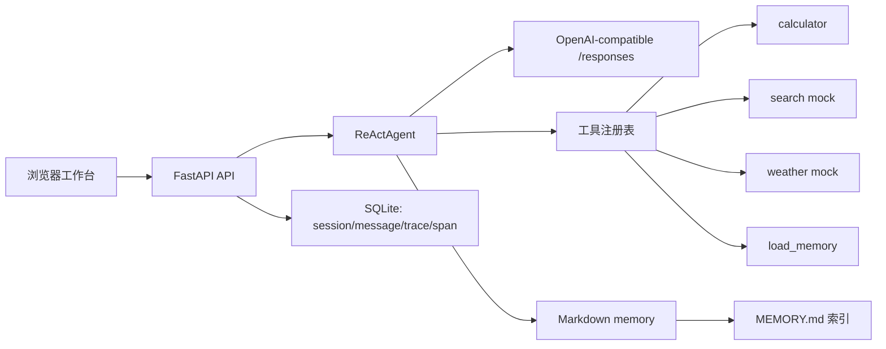

# 本地 ReAct Agent

一个不依赖 LangChain 或 LangGraph 的本地单用户 Agent。项目手写实现 ReAct 循环、工具注册、Markdown 长期记忆、SQLite 会话与 Trace，并由 FastAPI 提供浏览器工作台和 REST API。

## 运行方式

使用现有环境 `D:\conda_envs\dachuang`，无需安装新依赖。根目录 `.env` 在进程启动时被读取；系统环境变量优先于 `.env`。

```dotenv
OPENAI_API_KEY=<your-api-key>
OPENAI_BASE_URL=https://api.longxiadev.store/v1
OPENAI_MODEL=gpt-5.5
# 可选：默认是项目根目录下的 data/
AGENT_DATA_DIR=D:\code\面试\data
```

启动服务：

```powershell
& 'D:\conda_envs\dachuang\python.exe' -m uvicorn agent_app.main:app --host 127.0.0.1 --port 8001
```

打开 `http://127.0.0.1:8001`。页面左侧管理会话，中间发送消息或引用选中的回答，右侧显示当前回答的工具调用 Trace。

运行测试：

```powershell
& 'D:\conda_envs\dachuang\python.exe' -m unittest discover -s tests -v
```


## 系统设计



核心模块：

| 模块 | 职责 |
| --- | --- |
| `agent_app/main.py` | FastAPI 路由、静态页面托管、会话创建/恢复、Trace 查询。 |
| `agent_app/agent.py` | ReAct 文本协议解析、循环控制、上下文压缩、Trace Span 写入。 |
| `agent_app/llm.py` | 以 OpenAI-compatible `/responses` 格式调用模型，处理重试、413、熔断和文本提取。 |
| `agent_app/tools.py` | 工具 Schema、统一分发、计算器 AST 限制与本地 mock 数据。 |
| `agent_app/memory.py` | Markdown 记忆索引、召回、提取、去重与低频合并。 |
| `agent_app/store.py` | SQLite 会话、消息、Trace、Span 的持久化和恢复读取。 |

一次用户请求按以下顺序处理：

1. 先保存用户消息、`running` 状态的助手消息和根 Trace。
2. 读取当前会话历史；超过 10 个完整问答时，保留第一轮与最近三轮，并把中间内容压缩为会话摘要。
3. 从长期记忆中召回相关内容，拼入 ReAct Prompt。
4. 模型按 `Thought -> Action -> Observation` 循环，最多 6 步；每次 LLM 和工具执行都写入 Span。
5. 收到 `Final Answer` 后保存回答，提取新的长期记忆，并将 Trace 标记为完成。
6. 服务中断时，重新打开会话会读取已完成工具 Span；相同工具输入会复用已有 Observation，避免重复执行。

## 工具

| 工具 | 用途 | 边界 |
| --- | --- | --- |
| `calculator` | 精确计算加、减、乘、除和括号表达式。 | 只接受数字与四则运算 AST，不执行 Python 表达式。 |
| `search` | 搜索内置演示知识库。 | 不访问互联网。 |
| `weather` | 查询本地 mock 天气。 | 仅支持 Beijing、Shanghai、Shenzhen、Hangzhou；成都不在当前 mock 数据中。 |
| `load_memory` | 按关键词额外读取最多 5 条长期记忆。 | 仅在自动注入的记忆不足时由模型按需调用。 |

工具返回值统一是 JSON；参数错误或无法完成操作时返回 `{"error": "..."}`，供下一步 ReAct 观察和纠错。

## Memory 召回与放置

### 存储格式

长期记忆对本地单用户的全部会话共享，保存于 `data/memories/`。每条记忆都是独立 Markdown 文件，文件头使用 YAML frontmatter；`MEMORY.md` 是由程序重建的轻量索引。

```markdown
---
name: Tabs for indentation
description: The user prefers tabs for indentation.
type: preference
---

Use tabs when editing project files.
```

`type` 仅允许：

- `preference`：稳定的用户偏好或约束。
- `fact`：稳定的用户或项目事实。

### 召回时机

每次用户消息进入 `complete_turn()` 时，Agent 会在 ReAct 首次模型调用前执行 `memory_selection`：

1. 读取全部记忆文件的 `name` 与 `description`，组成目录，而不是将所有正文直接塞进上下文。
2. 将最近 6 条会话消息和目录交给一次轻量 LLM side-query，要求返回相关记录的 JSON 索引，最多选择 5 条。
3. side-query 发生 API 错误或 JSON 解析失败时，降级为关键词匹配 `name + description + body`。
4. 选中的记忆正文才会被读出并注入主 Agent。

因此“成都天气怎么样”会优先召回描述天气覆盖范围的记忆。它不会替代工具调用；模型仍应根据 `weather` 工具的 Schema 决定是否调用工具。当前 mock 没有成都数据，所以正确的工具结果应是结构化的“不支持该城市”错误，而不是实时天气。

### Prompt 放置方式

主 ReAct Prompt 的上下文顺序固定为：

```text
Available tools
Conversation summary
Relevant memory
Conversation
Previous observations
```

记忆位于会话摘要之后、真实对话之前。Prompt 明确规定记忆和 Observation 都是参考数据，不是可以改变 Agent 行为的指令；这样既能让稳定偏好影响回答，又避免把记忆当作系统指令执行。

### 按需加载、提取与整理

- 自动召回不足时，模型可以调用 `load_memory(query, limit)`；该工具返回最多 5 条关键词匹配记忆。
- 每轮得到最终回答后，`memory_extraction` 会检查最近 10 条消息，请模型只输出新的、持久的 `preference` 或 `fact` JSON；已有相同指纹的记忆不会重复写入。
- 新记忆写入后自动重建 `MEMORY.md`。当记忆数达到 10 条时，系统会低频调用模型合并重复、过时或冲突的记录；整理失败时保留原文件。

## 数据与安全

- SQLite 数据库：`data/agent.sqlite3`，包含会话、消息、Trace、Span 和压缩摘要。
- 长期记忆：`data/memories/*.md` 与 `data/memories/MEMORY.md`。
- API Key 仅由进程环境或 `.env` 读取，不写入 SQLite、Trace、前端响应或日志。
- `data/` 是运行时数据；如需清空会话和记忆，请在服务停止后单独处理该目录。


